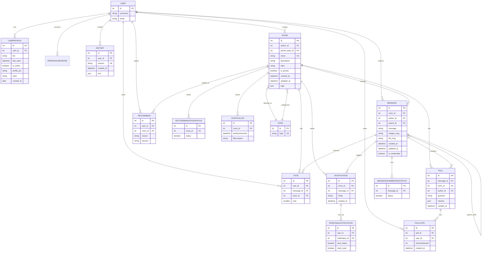

```mermaid

erDiagram
    USER ||--o{ USERPROFILE : has
    USER ||--o{ MESSAGE : authors
    USER ||--o{ VOTE : casts
    USER ||--o{ PERSONALMESSAGE : receives
    USER ||--o{ HISTORY : creates
    USER ||--o{ ROOM : creates
    USER ||--o{ POLLVOTE : votes
    USER ||--o{ RECOMMEND : makes
    
    ROOM ||--o{ MESSAGE : contains
    ROOM ||--o{ VOTE : has
    ROOM ||--o{ NOTIFICATION : sends
    ROOM ||--o{ POLL : has
    ROOM ||--o{ VECTORDBADDITIONSTATUS : tracks
    ROOM ||--o{ CHATFILELOG : stores
    ROOM ||--o{ RECOMMEND : related_to
    ROOM }o--|| TOPIC : belongs_to
    
    MESSAGE ||--o{ VOTE : receives
    MESSAGE ||--o{ NOTIFICATION : triggers
    MESSAGE ||--o{ POLL : contains
    MESSAGE ||--o{ MESSAGESUMMERIZEDSTATUS : has
    MESSAGE }o--|| MESSAGE : parent_child
    
    POLL ||--o{ POLLVOTE : has
    
    NOTIFICATION ||--o{ PERSONALNOTIFICATION : sent_as
    
    TOPIC ||--o{ ROOM : categorizes
    
    USER {
        int id PK
        string username
        string email
    }
    
    USERPROFILE {
        int id PK
        int user_id FK
        string bio
        datetime last_seen
        boolean is_online
        string profile_pic
        string roles
        date created_at
    }
    
    ROOM {
        int id PK
        int author_id FK
        int parent_topic_id FK
        string name UK
        string description
        string topic
        boolean is_private
        datetime created_at
        datetime updated_at
        json tags
    }
    
    TOPIC {
        int id PK
        string topic UK
    }
    
    MESSAGE {
        int id PK
        int room_id FK
        int author_id FK
        int parent_id FK
        string message
        string images_msg
        string file_msg
        datetime created_at
        datetime updated_at
        boolean is_moderated
    }
    
    VOTE {
        int id PK
        int user_id FK
        int message_id FK
        int room_id FK
        smallint vote
    }
    
    NOTIFICATION {
        int id PK
        int room_id FK
        int message_id FK
        string notify
        datetime created_at
    }
    
    PERSONALNOTIFICATION {
        int id PK
        int user_id FK
        int notification_id FK
        boolean sent_status
        boolean mark_read
    }
    
    POLL {
        int id PK
        int message_id FK
        int room_id FK
        int author_id FK
        string question
        json choices
        datetime created_at
    }
    
    POLLVOTE {
        int id PK
        int poll_id FK
        int user_id FK
        int choiceSelected
        datetime created_at
    }
    
    MESSAGESUMMERIZEDSTATUS {
        int id PK
        int message_id FK
        boolean status
    }
    
    VECTORDBADDITIONSTATUS {
        int id PK
        int room_id FK
        boolean status
    }
    
    CHATFILELOG {
        int id PK
        int room_id FK
        datetime lastSummerized
        string fileLocation
    }
    
    HISTORY {
        int id PK
        int user_id FK
        string session UK
        datetime created_at
        json hist
    }
    
    RECOMMEND {
        int id PK
        int user_id FK
        int room_id FK
        string reason
        string session
    }
``` 