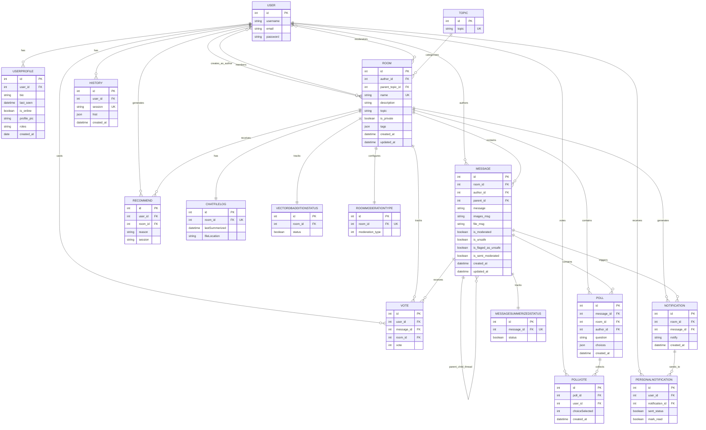

```mermaid
erDiagram
    USER ||--o{ USERPROFILE : "has"
    USER ||--o{ ROOM : "creates_as_author"
    USER }o--o{ ROOM : "members"
    USER }o--o{ ROOM : "moderators"
    USER ||--o{ MESSAGE : "authors"
    USER ||--o{ VOTE : "casts"
    USER ||--o{ POLLVOTE : "votes"
    USER ||--o{ HISTORY : "has"
    USER ||--o{ RECOMMEND : "generates"
    USER ||--o{ PERSONALNOTIFICATION : "receives"

    TOPIC ||--o{ ROOM : "categorizes"

    ROOM ||--o{ MESSAGE : "contains"
    ROOM ||--o{ VOTE : "tracks"
    ROOM ||--o{ POLL : "contains"
    ROOM ||--o{ NOTIFICATION : "generates"
    ROOM ||--o{ RECOMMEND : "receives"
    ROOM ||--|| CHATFILELOG : "has"
    ROOM ||--|| VECTORDBADDITIONSTATUS : "tracks"
    ROOM ||--|| ROOMMODERATIONTYPE : "configures"

    MESSAGE ||--o{ MESSAGE : "parent_child_thread"
    MESSAGE ||--o{ VOTE : "receives"
    MESSAGE ||--o{ POLL : "contains"
    MESSAGE ||--|| MESSAGESUMMERIZEDSTATUS : "tracks"
    MESSAGE ||--o{ NOTIFICATION : "triggers"

    POLL ||--o{ POLLVOTE : "collects"

    NOTIFICATION ||--o{ PERSONALNOTIFICATION : "sends_to"

    USER {
        int id PK
        string username
        string email
        string password
    }

    USERPROFILE {
        int id PK
        int user_id FK
        string bio
        datetime last_seen
        boolean is_online
        string profile_pic
        string roles
        date created_at
    }

    TOPIC {
        int id PK
        string topic "UK"
    }

    ROOM {
        int id PK
        int author_id FK
        int parent_topic_id FK
        string name UK
        string description
        string topic
        boolean is_private
        json tags
        datetime created_at
        datetime updated_at
    }

    MESSAGE {
        int id PK
        int room_id FK
        int author_id FK
        int parent_id FK
        string message
        string images_msg
        string file_msg
        boolean is_moderated
        boolean is_unsafe
        boolean is_flaged_as_unsafe
        boolean is_semi_moderated
        datetime created_at
        datetime updated_at
    }

    VOTE {
        int id PK
        int user_id FK
        int message_id FK
        int room_id FK
        int vote
    }

    POLL {
        int id PK
        int message_id FK
        int room_id FK
        int author_id FK
        string question
        json choices
        datetime created_at
    }

    POLLVOTE {
        int id PK
        int poll_id FK
        int user_id FK
        int choiceSelected
        datetime created_at
    }

    NOTIFICATION {
        int id PK
        int room_id FK
        int message_id FK
        string notify
        datetime created_at
    }

    PERSONALNOTIFICATION {
        int id PK
        int user_id FK
        int notification_id FK
        boolean sent_status
        boolean mark_read
    }

    MESSAGESUMMERIZEDSTATUS {
        int id PK
        int message_id FK "UK"
        boolean status
    }

    CHATFILELOG {
        int id PK
        int room_id FK "UK"
        datetime lastSummerized
        string fileLocation
    }

    VECTORDBADDITIONSTATUS {
        int id PK
        int room_id FK
        boolean status
    }

    ROOMMODERATIONTYPE {
        int id PK
        int room_id FK "UK"
        int moderation_type
    }

    HISTORY {
        int id PK
        int user_id FK
        string session UK
        json hist
        datetime created_at
    }

    RECOMMEND {
        int id PK
        int user_id FK
        int room_id FK
        string reason
        string session
    }
```