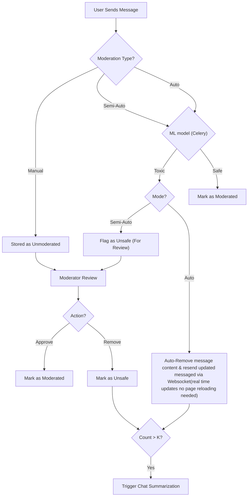
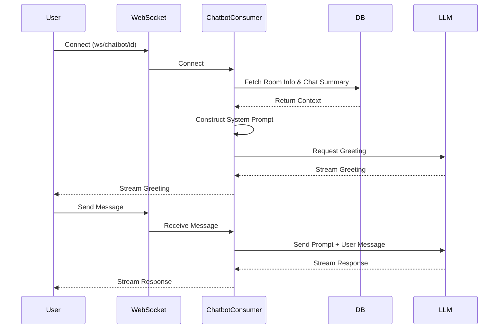
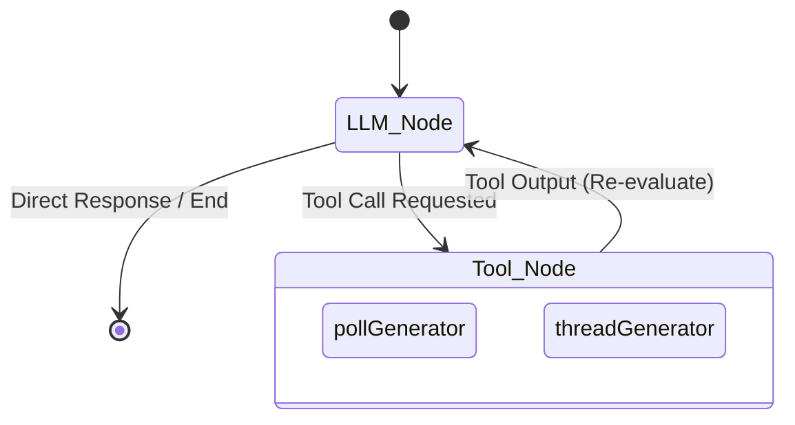
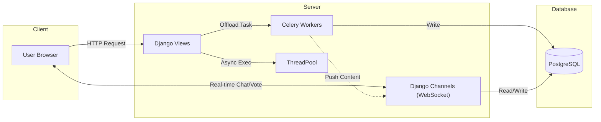

# Core Features Documentation

This document outlines the implementation details of the core features: **Moderation**, **Chatbot**, and **Room Agent**, as well as the **Advanced Architecture** supporting scalability and real-time interactions.

## 1. Moderation System

The moderation system is designed to maintain the safety and quality of chat rooms. It supports three levels of moderation: **Manual**, **Semi-Auto**, and **Auto**.

### 1.1 Data Models

**`RoomModerationType`** (`core/base/models/Room_Moderation_model.py`)

- Defines the moderation strategy for a room.
- **Fields**:
  - `room`: One-to-One relationship with `Room`.
  - `moderation_type`: Integer field using `ModerationType` enum.
    - `Manual (0)`: Moderators manually review messages.
    - `SemiAuto (-1)`: AI/System flags potentially unsafe messages for review.
    - `Auto (-2)`: System automatically handles unsafe messages.

### 1.2 Logic & Views

**`ModerationMessageApiview`** (`core/base/views/moderator/moderator_views.py`)

- **GET Request**: Fetches messages requiring moderation.
  - **Semi-Auto Mode**: Returns only messages flagged as unsafe (`is_flaged_as_unsafe=True`) and not yet moderated (`is_semi_moderated=True`).
  - **Manual Mode**: Returns all unmoderated messages (`is_moderated=False`).
- **POST Request**: Submits moderation actions.
  - Accepts `action_needed` (list of message IDs to remove) and `no_action_needed` (list of message IDs to approve).
  - Updates message status:
    - `action_needed`: Sets `is_unsafe=True` and updates content to "removed By Moderators...".
    - `no_action_needed`: Marks as moderated.
  - **Summarization Trigger**: If 10+ messages are approved, a background task (`add_summerize_task`) is triggered to update room summary.

### 1.3 Auto Moderation (Key Feature)

**`start_moderation`** (`core/base/tasks/moderation_task/moderator_flow.py`)

- **Mechanism**: A Celery shared task that runs periodically or on-demand.
- **ML Model**: Uses a pre-trained model (`joblib` loaded) to predict message toxicity.
- **Workflow**:
  1.  Fetches unmoderated messages from rooms with `Auto` or `SemiAuto` moderation.
  2.  Predicts toxicity for each message.
  3.  **Auto Mode**:
      - If toxic: Automatically replaces message content with a removal notice, marks as unsafe, and notifies the room via WebSocket (`connectToWs`).
      - Increments a Redis counter; triggers summarization if count exceeds threshold `K`.
  4.  **Semi-Auto Mode**:
      - If toxic: Flags message (`is_flaged_as_unsafe=True`) for manual review.
  5.  **Clean-up**: Marks non-toxic messages as moderated.

---

## 2. Chatbot

The Chatbot is an AI-powered assistant embedded in chat rooms, capable of answering questions based on the room's context and chat history (RAG - Retrieval-Augmented Generation).

### 2.1 Architecture

- **Websocket Consumer**: `LlmConsumer` (`core/base/consumers/chatbot_consumer.py`)
- **Endpoint**: `ws/chatbot/<room_id>/`
- **LLM Provider**: LangChain integration with OpenAI (via `base.views.userRecommendation.llm`).

### 2.2 Workflow

1.  **Connection**: User connects to the websocket. Authentication is required.
2.  **Context Loading (`contextGiver`)**:
    - Fetches the room's chat history from a file log (`ChatFileLog` model).
    - Constructs a **System Prompt** containing:
      - Room details (Name, Author, Description).
      - Previous conversations (Context).
      - Rules (Greet user, answer from context if relevant, generic otherwise).
3.  **Interaction**:
    - **Greeting**: Upon connection, the chatbot sends a personalized greeting.
    - **Message Handling**: When a user sends a message:
      - The message is combined with the System Prompt.
      - The LLM streams the response token-by-token back to the user via websocket.

---

## 3. Room Agent (Prototype)

The Room Agent is an experimental feature designed to proactively increase engagement in chat rooms.

> **Note**: The active logic is implemented as a Celery task in `core/base/tasks/agent_task.py`. The file `core/base/views/agent/room_agent.py` contains a legacy/prototype version.

### 3.1 Concept

- **Goal**: Increase activity by generating polls and interesting threads.
- **Framework**: Built using **LangGraph** for agentic workflows.

### 3.2 Components

- **Tools**:
  - `pollGenerator`: Generates relevant polls based on room context.
  - `threadGenerator`: Generates discussion threads/comments.
- **Agent Logic**:
  - Analyzes conversation context.
  - Decides whether to call a tool (e.g., generate a poll) or respond directly.
  - **Loop**: Can autonomously loop (re-run) to perform multiple actions if needed.

### 3.3 Status

- **Implementation**: The core logic resides in `core/base/tasks/agent_task.py`.
- **Note**: A previous/prototype version exists in `core/base/views/agent/room_agent.py` but is currently commented out and disabled.
- Integration points in `agent_view.py` (API endpoint to trigger agent) are also commented out.

---

## 4. Advanced Architecture & Scalability

To ensure the application remains responsive under heavy load and complex AI operations, we utilize a robust asynchronous architecture.

### 4.1 Asynchronous Task Management (Celery)

We use **Celery** to offload heavy, time-consuming tasks from the main request-response cycle. This prevents blocking the main thread and ensures a smooth user experience.

- **Agent Logic**: The core Room Agent logic (`main` in `core/base/tasks/agent_task.py`) is a `@shared_task`. This allows the complex LangGraph execution to run in the background.
- **Summarization**: The `add_summerize_task` (`core/base/tasks/summerization_tasks.py`) processes chat logs to generate summaries without delaying the moderation response.
- **Database Operations**: Heavy database writes for polls and threads generated by the agent are also offloaded (`savePolltoDb`, `saveThreadToDb`).

### 4.2 ThreadPool Management

For operations that are I/O bound but may not require the full overhead of a Celery worker, or for specific view-level concurrency, we use a custom **ThreadPoolManager**.

- **Implementation**: `core/base/threadPool.py`
- **Usage**: Provides a global `ThreadPoolExecutor` (default 4 workers) to manage concurrent threads efficiently. It ensures resources are cleaned up (`shutdown`) when the application exits.
- **Application**: Used in views (e.g., `agent_view.py`) to trigger agent tasks or other blocking calls without halting the main execution flow.

### 4.3 Real-time Architecture (Django Channels)

The application relies heavily on **WebSockets** for real-time features, handled by **Django Channels**.

- **Chat & Voting (`ChatConsumer`)**:
  - Handles high-frequency events like messaging and voting.
  - Broadcasts updates immediately to all users in a room (`room_<id>` group).
  - Manages user online status (`maintain_user_visibility`).
- **Agent Integration**:
  - Uniquely, the background Agent task connects _back_ to the WebSocket layer.
  - Using `connectToWs` (in `agent_task.py`), the agent pushes its generated content (polls, threads) directly to the room's WebSocket group.
  - This allows the Agent to appear and interact just like a real user in real-time.
- **Streaming AI**:
  - The Chatbot consumer (`LlmConsumer`) streams AI responses token-by-token, providing an immediate "typing" effect rather than waiting for the full response generation.

